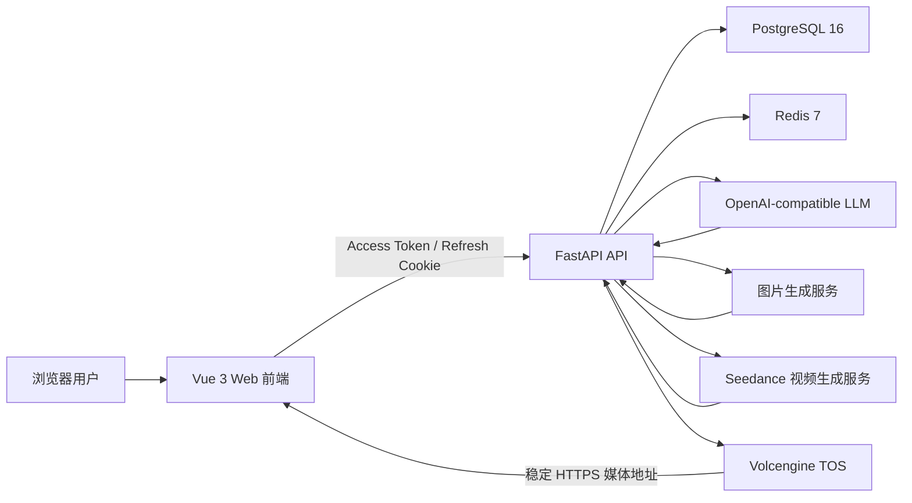

# MV Storyboard Agent

面向 MV 制作流程的 AI 分镜 Web 应用。用户可以上传带歌曲编号的 ASS 字幕，或直接创建通用 MV 分镜；系统结合歌曲情感配置、系统角色与用户要求，逐条并发生成分镜提示词，并继续生成场景图、视频片段和可下载的素材包。

当前版本：`v0.9.1 web 内测版初版`。

维护入口：[`AGENTS.md`](AGENTS.md)（Code Agent 约定）、[`ARCHITECTURE.md`](docs/ARCHITECTURE.md)、[`LOCAL-DEVELOPMENT.md`](docs/LOCAL-DEVELOPMENT.md)、[`TESTING.md`](docs/TESTING.md)、[`DEPLOYMENT.md`](docs/DEPLOYMENT.md)、[`ROLLBACK.md`](docs/ROLLBACK.md)、[`BACKUP-RESTORE.md`](docs/BACKUP-RESTORE.md) 和 [`SECURITY.md`](docs/SECURITY.md)。专题文档（`docs/`）：前端规范 `FRONTEND-GUIDELINES.md`、性能观测 `PERFORMANCE-MONITORING.md`、数字人资产链路 `ASSET-AVATAR.md`、歌曲分类数据 `SONG-CATEGORIES.md`、模型接入现状与剩余债务 `TODO_MODEL_EXPANSION.md`。

## 核心能力

- ASS 分镜：解析 ASS 时间轴和歌词，通过文件名中的歌曲编号匹配歌曲情感配置。
- 通用分镜：按曲风、情感、季节、角色、画幅、镜头数和总时长规划空镜与人物镜。
- 渐进式生成：单次 API 只生成一条分镜提示词，前端以受控并发完成全量任务，减少首条结果等待时间。
- 角色库：内置成人与儿童系统角色，按“男 / 女 / 儿童”三个只读默认分类展示，所有用户可见；用户上传或生成的私有角色及媒体彼此隔离。
- 媒体生成：场景图与视频异步生成，视频时长支持 4–15 秒整数，画幅支持 16:9、9:16、4:3、1:1。
- 生成配置：ASS 与通用分镜均保存画幅、清晰度、图片模型和视频模型；可用模型由管理后台注册中心（`/api/model-options`）动态下发。
- 管理控制台：仪表盘、项目/用户/生成任务/费用用量、提示词管理、通用分类全量自定义（树形 CRUD + 种子迁移）、模型注册中心启停、Kling 与 RunningHub H3 工作流测试面板、错误日志/操作审计/LLM 调用/接口耗时/性能页；侧边导航按「总览 / 业务运营 / 内容配置 / 模型实验室 / 系统监控」五组两级分组。
- 素材导出：将子项目内的视频片段与整体提示词 Markdown 以低内存流式方式打包到 TOS；每个子项目拥有独立异步导出任务，SSE 实时显示阶段和进度。
- 多用户与鉴权：短期 Access Token + Refresh Token，管理员和普通用户的数据按所有权隔离。
- 数据审计：所有业务删除均为软删除；模型调用记录输入、输出及缓存 Token；后端 API 错误脱敏后入库。
- 单用户日限额：管理员可为每个账户分别设置 Chat、图片和视频的每日调用上限；默认按北京时间自然日均为 1000 次，并使用数据库原子计数避免并发穿透。
- TOS 媒体存储：上传图片、生成图片、视频、首帧封面和导出包均持久化到 TOS，项目目录不保存业务媒体文件。

## 用户旅程

### ASS 分镜

1. 用户登录并创建歌曲项目。
2. 上传 ASS 文件；文件名必须包含数字歌曲编号。
3. 后端解析字幕并在 `song_emotion_profiles` 中匹配歌曲情感配置；无法匹配或显式编号不一致时返回可读错误。
4. 用户选择系统角色或自己的私有角色。
5. 后端创建任务、歌词分段、歌曲视觉圣经、场景池、视觉母题与待生成分镜行；明确人物动作歌词强制使用人物镜，长段落在统一世界观内推进多个关联场景。
6. 前端按并发上限逐条调用提示词生成 API，每条请求携带当前歌词和全量歌词上下文。
7. 用户逐镜生成场景图，再以场景图、角色和镜头提示词生成 4–15 秒视频片段。
8. 用户在播放器和时间轴中检查结果，最后导出视频片段与提示词 ZIP。

### 通用 MV 分镜

1. 用户创建项目，选择通用分镜。
2. 设置音乐分类、季节、年龄段、视觉风格、画幅、空镜/人物镜数量、总时长与角色；爱情分类要求手动选角，其他分类未选角时由系统自动匹配系统人物。
3. 系统校验每镜规划时长均可落在 4–15 秒，并构建统一故事弧线与角色连续性约束。
4. 前端并发请求每一条分镜提示词；空镜禁止人物，人物镜使用预分配角色。
5. 后续场景图、视频、播放器和素材导出流程与 ASS 分镜一致。

## 技术架构



### 前端

- Vue 3、TypeScript、Vite
- Pinia：项目、任务、分镜、媒体和播放状态
- Vue Router：登录、主编辑器、密码修改、管理后台（含用户管理）
- 原生 Fetch API：统一 Access Token 注入、刷新和错误处理
- Vitest + Vue Test Utils：单元与状态测试
- Playwright：浏览器用户旅程与真实生成验收
- Nginx：Docker Web 静态资源及 `/api` 反向代理

### 后端

- Python 3.12、FastAPI、Pydantic
- SQLAlchemy Async + asyncpg：PostgreSQL 异步数据访问
- Alembic：数据库迁移
- Redis：生成任务热状态、SSE 事件和跨进程发布订阅
- httpx：模型、媒体供应商和远程资源访问
- PyJWT + Argon2：Access/Refresh Token 与密码哈希
- Volcengine TOS Python SDK：TOS 对象存储访问
- pytest：API、多用户隔离、存储、提示词质量和完整用户旅程测试

### 数据与安全

PostgreSQL 是持久化事实来源，主要保存用户、刷新令牌、项目、子任务、角色关系、分镜行、场景/视频/语音资产、生成任务、素材导出、聊天、歌曲情感配置、Token 账单和 API 错误日志。

- 所有新增业务表均包含 `created_at`、自动更新的 `updated_at` 和 `deleted_at`。
- 删除接口只写入 `deleted_at`，不物理删除业务数据。
- 系统角色可被所有用户读取，私有角色、项目和生成媒体按 `user_id`/项目所有权隔离。
- 请求日志会对密码、Token、Cookie 等敏感字段脱敏。
- 浏览器不会获得模型供应商或 TOS 密钥。

## 目录结构

```text
.
├── src/                         Vue 前端
│   ├── api/                     API 与媒体生成客户端
│   ├── components/              编辑器、角色库、播放器和全局弹窗
│   ├── stores/                  Pinia 状态与用户旅程编排
│   └── views/                   登录、账户和管理页面
├── backend/
│   ├── app/                     FastAPI、领域服务、任务、存储和种子数据
│   ├── migrations/              Alembic 迁移
│   └── tests/                   后端自动化测试
├── e2e/                         Playwright 端到端测试
│   ├── user/                    用户侧旅程、远程冒烟与真实生成全链路
│   ├── admin/                   管理后台 API 契约与控制台 UI
│   └── env.ts                   共享凭据与目标环境
├── tests/                       前端单元测试
│   ├── user/                    用户侧组件/Store/工具
│   ├── admin/                   管理后台面板
│   └── setup.ts                 Vitest 共享 setup
├── docs/                        专题文档（架构/测试/部署/安全/性能/资产链路等）
├── test-artifacts/full-journey/ 固化 ASS 输入与全链路基准截图
└── docker-compose.yml           完整环境编排
```

## 运行依赖

推荐使用 Docker 启动完整环境：

- Docker Desktop / Docker Engine，支持 Compose v2
- 可用的 PostgreSQL、Redis、LLM、图片生成、视频生成和 TOS 配置
- 浏览器访问端口默认 `5173`

本地开发额外需要：

- Node.js 22+ 与 npm
- Python ≥ 3.11（容器内为 3.12）
- PostgreSQL 16
- Redis 7

## 配置

后端示例配置位于 [`backend/.env.example`](backend/.env.example)。首次运行至少需要准备：

```bash
cp backend/.env.example backend/.env
```

然后配置以下类别：

- `JWT_SECRET`：至少 32 字符的随机值，服务器测试环境禁止使用 Compose 默认值。
- `LLM_*`：兼容 OpenAI 协议的分镜文本模型。
- `IMAGE_*`：图片生成服务。
- `VIDEO_*`：视频生成服务。
- `TOS_*`：引用媒体桶、视频归档桶、前缀和公开域名。
- `BUSINESS_API_KEY`、`BUSINESS_USER_ID`：顶部栏业务余额查询凭证；未配置时安全显示 `--`，不会阻塞其他功能。
- `DATABASE_URL`、`REDIS_URL`：本地启动时的数据服务地址。

项目也支持将统一供应商配置放在 `backend/.provider_config.py`，Compose 会将其作为 secret 挂载。`backend/.env`、`.env.chat` 和 `.provider_config.py` 均已被 Git 忽略，严禁提交真实密钥。

## Docker 启动

```bash
make dev            # 组合加载 local-build 覆盖（镜像加速）后 docker compose up -d
docker compose ps
```

本机所有 compose 入口均固定加载 `docker-compose.local-build.yml` 走国内镜像代理，不直连 docker.io；手动执行 compose 命令时必须带 `-f docker-compose.yml -f docker-compose.local-build.yml`，详见 [`LOCAL-DEVELOPMENT.md`](docs/LOCAL-DEVELOPMENT.md)。

服务地址：

- Web：<http://127.0.0.1:5173>
- 健康检查：<http://127.0.0.1:5173/api/health>
- PostgreSQL：`127.0.0.1:5433`
- Redis：`127.0.0.1:6380`

后端容器启动时会自动执行 Alembic 迁移并补齐系统种子数据。首次管理员账号默认为：

```text
用户名：admin
密码：123456
```

首次登录后应立即修改密码。停止服务：

```bash
docker compose down
```

该命令不会删除命名卷。只有明确需要销毁数据库与 Redis 数据时才使用 `docker compose down -v`。

## 本地开发启动

先启动数据服务：

```bash
docker compose -f docker-compose.yml -f docker-compose.local-build.yml up -d postgres redis
```

启动后端：

```bash
cd backend
python3.13 -m venv .venv
source .venv/bin/activate
pip install -r requirements.txt -r requirements-dev.txt
alembic upgrade head
uvicorn app.main:app --reload --host 127.0.0.1 --port 8000
```

另开终端启动前端：

```bash
npm ci
npm run dev -- --host 127.0.0.1 --port 5173
```

Vite 开发服务器会将 `/api` 代理到后端。

## 测试

前端与管理后台测试按目录分组，可独立运行：

```bash
npm run test:unit:user    # 用户侧单测
npm run test:unit:admin   # 管理后台单测
npm test                  # 全量单测
npm run test:e2e:user     # 用户侧 e2e（本地 mock 链路）
npm run test:admin        # 管理后台 e2e（远程 API 契约 + 控制台 UI）
cd backend && .venv/bin/pytest -q   # 后端测试
```

日常提交前跑 `make preflight-lite`（约 70s，跳过 Docker 构建）；发布前跑完整 `make preflight`（约 90s）。按改动范围选择最小验证集的耗时矩阵见 [`docs/TESTING.md`](docs/TESTING.md)。

真实 ASS + 通用分镜测试会调用付费模型和媒体供应商，必须显式开启：

```bash
export PLAYWRIGHT_BASE_URL=http://127.0.0.1:5173
export REAL_E2E_RUN_ID="$(date +%Y%m%d-%H%M%S)"
export REAL_E2E_PROJECT_SUFFIX="$REAL_E2E_RUN_ID"
npm run test:e2e:real
```

断点恢复、截图约定、数据库核验、远程验收与上线清单统一见 [`docs/TESTING.md`](docs/TESTING.md)。首次真实验收的基准截图保留在 `test-artifacts/full-journey/screenshots/`。

## 常用运维命令

```bash
docker compose logs -f backend
docker compose exec backend alembic current
docker compose exec postgres psql -U mvagent -d mvagent
docker compose exec redis redis-cli
```

数据库结构变更必须通过 Alembic 迁移；清理业务数据必须使用产品删除 API 或更新 `deleted_at`，不得绕过软删除规则。

## 当前状态

`v0.9.1` 是 Web 内测版初版，已完成登录、多用户隔离、ASS/通用分镜、逐条提示词生成、角色库、TOS 媒体、图片/视频生成、素材导出、Token 记账、错误审计及完整自动化测试资产。当前只维护本地开发环境和服务器测试环境；预发布、正式生产及其容量/安全方案在 v1.0.0 完成后再考虑。服务器测试部署前仍须轮换密钥、修改默认密码并验证外部服务限流。
