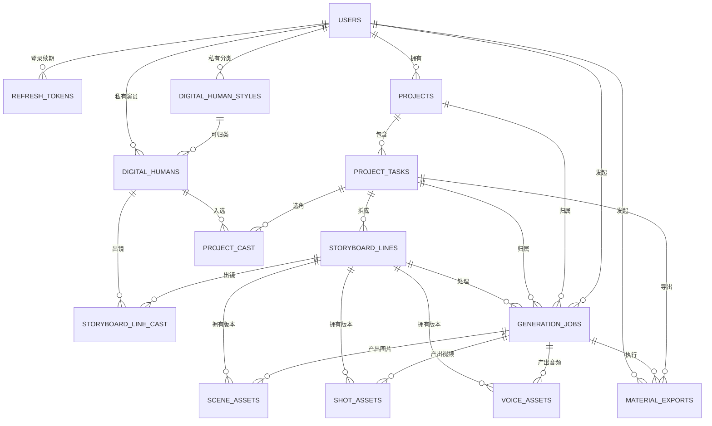
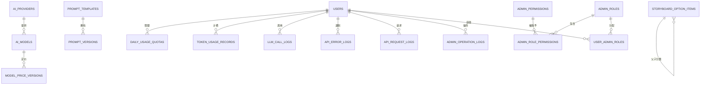

# 数据库全景与用户旅程教程（费曼版）

> 基准：代码仓库当前 Alembic head `1ab7d39e5c20`。本文以 `backend/app/models.py`、全部 Alembic 迁移和实际 API 写入链路交叉核对，共覆盖 34 张表。

## 1. 先用一句人话讲清楚系统

把系统想象成一家“AI MV 制片厂”：

- `users` 是客户档案；
- `projects → project_tasks → storyboard_lines` 是“作品 → 制作方案 → 镜头清单”三层文件夹；
- `digital_humans` 是演员库，两个 Cast 表是“整部片选角”和“某个镜头实际出场”；
- `generation_jobs` 是每一次交给 AI 供应商的工单；
- `scene_assets / shot_assets / voice_assets` 是工单生产出的图片、视频和音频索引，真正文件在 TOS；
- `material_exports` 把一组镜头成品打成 ZIP；
- 配额、Token、LLM 调用、请求、错误和管理员操作表像财务与监控摄像头，跟随主流程记账，但不承载作品本身。

最重要的主干只有一条：

```text
用户 → 项目 → 子任务 → 分镜行 → 生成工单 → 媒体资产 → 素材导出
```

## 2. 三种“数据”不要混为一谈

### 2.1 PostgreSQL：事实账本

本文的 34 张表都在 PostgreSQL。任务最终状态、媒体 URL、生成结果和用量以这里为准。

### 2.2 Redis：跑动中的传令兵

Redis 保存生成任务热状态、SSE 事件和跨进程发布订阅。页面刷新后仍要回 PostgreSQL 恢复，因此 Redis 不是第 35 张业务表，也不是最终事实源。

### 2.3 TOS：真正的媒体仓库

图片、缩略图、视频、封面、ASS 和导出 ZIP 的二进制实体放在 TOS；数据库只保存 URL 和元数据。删除数据库记录不等于自动删除 TOS 对象，二者是不同生命周期。

## 3. 全局读图规则

除非表格中特别说明，每张表都继承三列：

| 共享列       | 含义                               |
| ------------ | ---------------------------------- |
| `created_at` | 首次入库时间                       |
| `updated_at` | 最近更新时间，ORM 更新时自动刷新   |
| `deleted_at` | 软删除时间；为 `NULL` 才是活跃记录 |

所有业务删除都应写 `deleted_at`，查询通常必须带 `deleted_at IS NULL`。外键只保证“引用的 ID 存在”，不会自动保证同属一个用户；用户隔离由 API 从 `users → projects → project_tasks → storyboard_lines` 校验所有权。

图中：

- `A ||--o{ B`：一个 A 可以有多个 B；
- 虚线或文字注明的“逻辑引用”不是数据库外键；
- 多个可空外键表示一条日志可以只挂在当前已知的业务层级。

## 4. 核心实体关系图



注意两个刻意的“非关系”：

1. `projects.song_code` 与 `song_emotion_profiles.song_code` 业务上匹配，但数据库没有外键。ASS 创建时从文件名解析编号，再查询情感档案。
2. `prompt_templates.current_version_id` 指向当前发布版本，但当前模型/迁移没有数据库外键；真正外键方向是 `prompt_versions.template_id → prompt_templates.id`。

## 5. 按用户旅程理解数据流

### 旅程 1：登录——先确认“你是谁”

```text
用户名/密码
  → users 校验 password_hash、status、deleted_at
  → 返回短期 Access Token
  → refresh_tokens 保存 Refresh Token 的哈希
  → 后续请求从 Token 恢复 user_id
```

`users` 是所有私有数据的隔离根。浏览器拿到原始 Refresh Token，库里只存 `token_hash`；刷新时旧令牌撤销并轮换。管理员身份既有 `users.role` 这个当前入口，也有完整 RBAC 表组供精细权限扩展。

### 旅程 2：准备演员——系统演员共享，私人演员隔离

```text
上传或远程导入头像 → 原图与缩略图进入 TOS
  → digital_humans 写头像 URL、描述、user_id、scope=private
  → 向 AIGC 平台注册虚拟人资产
  → asset_avatar_url 写成 asset://...
```

系统演员的 `user_id` 可空、`scope=system`，由种子维护且用户只读；私人演员必须有当前 `user_id`。`digital_human_styles` 是演员分类。换头像时旧 `asset_avatar_url` 必须清空并重新注册，因为虚拟资产绑定具体图片。

### 旅程 3A：创建 ASS 分镜

```text
创建 projects
  → ASS 上传 TOS
  → 文件名解析 song_code
  → 查询 song_emotion_profiles（逻辑匹配）
  → 创建 project_tasks，source_ass_url 指向 TOS
  → project_cast 写整项候选演员
  → 解析字幕，批量创建 storyboard_lines
  → API将完整人物/字幕段/情感/额外要求快照写 generation_jobs（ass_outline）
  → worker-storyboard生成歌曲级视觉圣经/场景计划并写 storyboard_config、overall_prompt、每行 shot_options
  → 逐行调用 LLM，写 scene_prompt / shot_prompt / generation_status
  → storyboard_line_cast 固化每行实际演员
```

这里要分清：`project_cast` 是候选演员名单，`storyboard_line_cast` 才是某一镜真正出现的人。歌曲情感档案被读入提示词上下文，但不会复制出一条外键关系。

大纲与场景段重试均以 `generation_jobs` 为事实工单：`request` 保存可重放输入，`progress/updated_at` 保存进度与租约心跳，`attempt` 限制自动重放次数。API与工单写入同一事务，因此不会出现任务已显示生成中但没有可领取工单的半状态。

### 旅程 3B：创建通用分镜

```text
读取 storyboard_option_items
  → 用户选择曲风/季节/年龄/视觉风格
  → 中文名称快照写进 project_tasks.storyboard_config
  → 创建镜头占位 storyboard_lines
  → 大纲与逐行生成流程同 ASS
```

选项保存的是“配置源”，项目保存的是“当时选择的中文快照”。以后管理员改名或软删选项，旧项目仍能按原文复现。这是有意的反规范化设计。

### 旅程 4：逐镜生成图片和视频

```text
点击生成
  → daily_usage_quotas 原子加一并检查日限额
  → 校验 ai_models 中模型可见、启用、模态正确
  → generation_jobs 创建 queued 工单
  → Redis/SSE 推送 queued → running → succeeded/failed
  → 供应商返回远程媒体
  → 原文件和缩略图导入 TOS
  → scene_assets 或 shot_assets 入库
  → generation_jobs.result 写结果摘要并完成
```

生成视频前，角色的普通 TOS 头像 URL 会被替换为 `digital_humans.asset_avatar_url`；场景图 URL 保持不变。一个分镜行可以反复生成，因此资产表是一对多历史；`is_current=true` 指示当前采用版本，旧版本可以保留。

`voice_assets` 与图片/视频同构，是语音资产槽位；当前主要用户旅程没有对应公开创建入口，应视为已建模的扩展能力，不要误写成当前必经步骤。

### 旅程 5：每次模型调用同时产生三种旁路记录

```text
业务调用
  ├─ daily_usage_quotas：今天还能不能调用（限流计数）
  ├─ token_usage_records：用了多少 Token（可聚合账本）
  └─ llm_call_logs：当时发了什么、回了什么、多久、命中哪个提示词版本（诊断证据）
```

三者不是重复数据：配额回答“次数”，Token 账本回答“成本”，LLM 日志回答“为什么生成成这样”。图片/视频通常有生成工单和配额记录；文本 LLM 还会有 Token 与全量调用留痕。

### 旅程 6：素材导出

```text
用户选择 project_task
  → material_exports 创建导出记录
  → generation_jobs 创建 export 工单并互相关联
  → 查询该 task 下当前 shot_assets
  → 从 TOS 流式读取视频，生成提示词 Markdown
  → 打包 ZIP 再上传 TOS
  → archive_url / archive_size 与进度落 material_exports
```

每个导出有独立 ID、临时目录和对象键。SSE 只显示实时进度，刷新后由 `material_exports` 恢复。

### 旅程 7：聊天

```text
users → chat_sessions → chat_messages
                    └→ token_usage_records.chat_session_id
```

一轮用户消息和模型回答各是一行 `chat_messages`。会话软删不会物理清除历史消息；查询必须排除软删会话和消息。聊天用量可通过 `chat_session_id` 单独聚合。

### 旅程 8：管理员配置与审计

```text
供应商 ai_providers → 模型 ai_models → 价格版本 model_price_versions
提示词 prompt_templates → prompt_versions → 发布后 current_version_id 回指
通用选项 storyboard_option_items → 前台创建配置快照
管理员写操作 → admin_operation_logs
测试/全量接口流量 → api_request_logs
异常 → api_error_logs
```

H3 模型实验数据单独存 `h3_test_presets`，按管理员 `user_id` 隔离，输入输出媒体是 JSON 快照，不与正式项目/分镜资产建外键。

## 6. 34 张表逐表字典

下列“字段”省略三列共享生命周期字段，但它们实际存在于每张表。

### A. 身份与权限（8 张）

#### 1. `users`：用户主档

- 主键：`id`。
- 字段：`username`（唯一）、`password_hash`、`display_name`、`role`、`status`、`must_change_password`、`last_login_at`。
- 流向：认证根、私有数据所有权根；被项目、令牌、角色、任务、日志等大量表引用。

#### 2. `refresh_tokens`：登录续期凭证

- 主键：`id`；外键：`user_id → users.id`。
- 字段：`token_hash`（唯一）、`expires_at`、`revoked_at`、`user_agent`、`ip_address`。
- 流向：登录创建，刷新时轮换，退出时撤销；绝不存原始令牌。

#### 3. `admin_roles`：后台角色

- 主键：`id`。
- 字段：`code`（唯一）、`name`、`description`。
- 关系：通过 `user_admin_roles` 分配给用户，通过 `admin_role_permissions` 获得权限。

#### 4. `admin_permissions`：后台权限原子项

- 主键：`id`。
- 字段：`code`（唯一）、`name`。

#### 5. `admin_role_permissions`：角色—权限多对多桥

- 主键：`id`；外键：`role_id → admin_roles.id`、`permission_id → admin_permissions.id`。
- 含义：一行表示某角色拥有某权限。

#### 6. `user_admin_roles`：用户—后台角色多对多桥

- 主键：`id`；外键：`user_id → users.id`、`role_id → admin_roles.id`。
- 含义：一行表示某用户被授予某后台角色。

#### 7. `admin_operation_logs`：管理员写操作审计

- 主键：`id`；外键：`admin_user_id → users.id`。
- 字段：`action`、`target_type`、`target_id`、`before_data`、`after_data`、`client_ip`。
- 注意：`target_id` 是多态逻辑引用，不是外键；因为目标可能来自不同表。

#### 8. `h3_test_presets`：管理员 H3 实验预设与归档

- 主键：`id`；外键：`user_id → users.id`。
- 字段：`name`、`mode`、`prompt`、`duration`、`aspect_ratio`、`input_media`、`output_media`、`task_id`、`task_status`、`usage_data`、`sort_order`。
- 注意：`task_id` 是上游 RunningHub 任务标识，不是 `project_tasks.id` 外键。

### B. 项目与内容生产（9 张）

#### 9. `projects`：作品级容器

- 主键：`id`；外键：`user_id → users.id`。
- 字段：`name`、`artist`、`song_code`、`description`、`status`、`cover_url`、`sort_order`。
- 数据流：用户创建作品；一个作品下可有多种分镜方案。
- 注意：`song_code` 对曲库是逻辑引用，无外键。

#### 10. `song_emotion_profiles`：歌曲情感曲库

- 主键：`song_code`（这张表没有单独 `id`）。
- 字段：`song_name`、`artists`、`primary_category`、`secondary_category`、`tertiary_category`、`material_category`、`seasons`、`atmosphere`、`source_payload`。
- 数据流：由种子/数据文件导入，ASS 创建时按编号读取，向视觉圣经与提示词提供情感上下文。

#### 11. `project_tasks`：一次具体制作方案/子项目

- 主键：`id`；外键：`project_id → projects.id`。
- 字段：`title`、`storyboard_type`、`status`、`source_ass_url`、`extra_requirement`、`overall_prompt`、`storyboard_config`、`sort_order`。
- 数据流：承接 ASS 或通用分镜配置，是分镜行、选角和导出的直接父级。
- JSON：`storyboard_config` 保存画幅、模型、视觉圣经、场景计划和用户选项等快照；内部结构不是数据库外键。

#### 12. `digital_human_styles`：人物分类

- 主键：`id`；外键：可空 `user_id → users.id`。
- 字段：`name`、`scope`、`sort_order`。
- 约束：活跃记录上 `(user_id, name)` 部分唯一；软删后可重新创建同名分类。

#### 13. `digital_humans`：数字人物/演员

- 主键：`id`；外键：可空 `user_id → users.id`、可空 `style_id → digital_human_styles.id`。
- 媒体字段：`avatar_url`、`avatar_thumbnail_url`、`asset_avatar_url`。
- 描述字段：`name`、`description`、`avatar_prompt`、`asset_code`、`gender`、`age_description`、`appearance_style`、`clothing_description`、`suitable_music_styles`、`system_prompt`。
- 控制字段：`source`、`scope`、`status`。
- 约束：活跃 `asset_code` 部分唯一。系统人物通常 `user_id=NULL, scope=system`；私人人物带 `user_id`。

#### 14. `project_cast`：子项目候选演员桥表

- 主键：`id`；外键：`project_task_id → project_tasks.id`、`digital_human_id → digital_humans.id`。
- 字段：`sort_order`。
- 约束：同一子任务内同一演员在活跃记录中只能出现一次。

#### 15. `storyboard_lines`：分镜行，创作链路最细业务单位

- 主键：`id`；外键：`project_task_id → project_tasks.id`。
- 顺序与来源：`sort_order`、`source`、`shot_type`、`planned_duration`。
- 字幕时间轴：`lyrics`、`lyrics_zh`、`start_time`、`end_time`。
- 生成内容：`scene_prompt`、`shot_prompt`、`shot_options`。
- 生成状态：`generation_status`、`generation_error`、`generation_attempt`、`prompt_context_hash`、`generated_at`。
- 数据流：从字幕段或通用镜头规划产生，经 LLM 补全提示词，再成为媒体生成的锚点。

#### 16. `storyboard_line_cast`：分镜行—演员桥表

- 主键：`id`；外键：`storyboard_line_id → storyboard_lines.id`、`digital_human_id → digital_humans.id`。
- 字段：`sort_order`。
- 约束：同一分镜行内同一演员在活跃记录中只能出现一次。

#### 17. `storyboard_option_items`：通用分镜动态选项

- 主键：`id`；自外键：可空 `parent_id → storyboard_option_items.id`。
- 字段：`kind`、`name`、`sort_order`。
- 结构：`kind=genre` 用自关联形成最多三级树；`season / age_group / visual_style` 等为平铺列表。
- 流向：管理后台维护 → 前台动态读取 → 选择结果以名称快照进入 `project_tasks.storyboard_config`。

### C. 工单、媒体与导出（5 张）

#### 18. `generation_jobs`：统一异步生成工单

- 主键：`id`。
- 可空外键：`user_id → users.id`、`project_id → projects.id`、`project_task_id → project_tasks.id`、`storyboard_line_id → storyboard_lines.id`。
- 字段：`kind`、`status`、`progress`、`request`、`result`、`error`、`provider`、`provider_task_id`、`attempt`、`idempotency_key`、`started_at`、`finished_at`。
- 状态流：典型为 `queued → running → succeeded/failed`。
- 设计含义：同一张表容纳图片、视频、分镜 LLM、导出等工单；`request/result` 是供应商和任务种类相关的 JSON 快照。

#### 19. `scene_assets`：场景图片版本

- 主键：`id`；外键：`storyboard_line_id → storyboard_lines.id`、可空 `generation_job_id → generation_jobs.id`。
- 字段：`image_url`、`image_thumbnail_url`、`prompt`、`status`、`is_current`。
- 流向：图片工单成功 → 原图/缩略图进 TOS → URL 入表。

#### 20. `shot_assets`：视频镜头版本

- 主键：`id`；外键：`storyboard_line_id → storyboard_lines.id`、可空 `generation_job_id → generation_jobs.id`。
- 字段：`cover_url`、`cover_thumbnail_url`、`video_url`、`duration`、`resolution`、`ratio`、`prompt`、`status`、`is_current`。
- 流向：视频工单成功 → 视频、尾帧/封面及缩略图进 TOS → URL 入表 → 播放与导出读取。

#### 21. `voice_assets`：语音资产版本

- 主键：`id`；外键：`storyboard_line_id → storyboard_lines.id`、可空 `generation_job_id → generation_jobs.id`。
- 字段：`audio_url`、`duration`、`voice_config`、`status`、`is_current`。
- 定位：数据模型已就绪，当前主用户旅程中不是必经链路。

#### 22. `material_exports`：素材包导出事实与进度

- 主键：`id`；外键：`user_id → users.id`、`project_task_id → project_tasks.id`、可空 `generation_job_id → generation_jobs.id`。
- 状态字段：`status`、`progress`、`stage`、`error`、`started_at`、`finished_at`。
- 计量字段：`total_assets`、`processed_assets`、`total_bytes`、`processed_bytes`、`archive_size`。
- 结果字段：`archive_url`。

### D. 聊天（2 张）

#### 23. `chat_sessions`：聊天会话

- 主键：`id`；可空外键：`user_id → users.id`。
- 字段：`title`、`system_prompt`、`status`。
- ORM 关系：按消息 ID 顺序加载 `chat_messages`。

#### 24. `chat_messages`：聊天消息

- 主键：自增整数 `id`；外键：`session_id → chat_sessions.id`。
- 字段：`role`、`content`。
- 数据流：每次提问先写 `role=user`，模型完成后写 `role=assistant`。

### E. 配额、成本与可观测性（5 张）

#### 25. `daily_usage_quotas`：用户每日分类计数器

- 主键：`id`；外键：`user_id → users.id`。
- 字段：`usage_date`（北京时间自然日口径）、`category`、`usage_count`。
- 唯一约束：`(user_id, usage_date, category)`。
- 流向：生成调用前原子加一；当前类别覆盖文本、图片、视频等日限额。

#### 26. `token_usage_records`：Token 聚合账本

- 主键：`id`。
- 可空外键：`user_id`、`project_id`、`project_task_id`、`storyboard_line_id`、`generation_job_id`、`chat_session_id` 分别指向对应主表。
- 维度字段：`operation`、`provider`、`model`、`request_id`。
- 用量字段：`input_tokens`、`output_tokens`、`cached_input_tokens`、`total_tokens`、`raw_usage`。
- 设计：允许只关联到已知层级，方便按用户、项目、任务、镜头或聊天聚合。

#### 27. `llm_call_logs`：LLM 调用全量证据

- 主键：`id`。
- 可空外键：`user_id`、`project_id`、`project_task_id`、`storyboard_line_id`、`generation_job_id`。
- 调用字段：`operation`、`provider`、`model`、`request_id`、`status`、`error`、`duration_ms`。
- Token 字段：`input_tokens`、`output_tokens`、`cached_input_tokens`、`total_tokens`。
- 内容字段：`request_messages`、`response_text`、`prompt_key`、`prompt_version`。
- 注意：`prompt_key/prompt_version` 是可审计快照，不是外键，模板之后切版也不改变旧日志。

#### 28. `api_error_logs`：后端错误留痕

- 主键：`id`；可空外键：`user_id → users.id`。
- 字段：`error_code`（唯一）、`method`、`path`、`query_string`、`status_code`、`error_type`、`message`、`request_payload`、`traceback`、`client_ip`、`user_agent`。
- 安全：密码、Token、Cookie 等敏感字段应先脱敏再写入。

#### 29. `api_request_logs`：接口耗时与测试运行留痕

- 主键：`id`；可空外键：`user_id → users.id`。
- 字段：`run_id`、`method`、`path`、`query_string`、`status_code`、`duration_ms`、`request_payload`、`response_body`、`client_ip`。
- 触发：主要在带 `X-Test-Run-Id` 或开启全量记录开关时入库，不是所有请求必写。

### F. 模型、价格与提示词配置（5 张）

#### 30. `ai_providers`：AI 供应商注册

- 主键：`id`。
- 字段：`code`（唯一）、`name`、`base_url`、`status`。
- 关系：一个供应商拥有多个 `ai_models`。

#### 31. `ai_models`：前后台统一模型注册中心

- 主键：`id`；外键：`provider_id → ai_providers.id`。
- 字段：`code`（唯一）、`name`、`modality`、`provider_model_id`、`capabilities`、`status`、`user_visible`、`is_default`、`sort_order`。
- 流向：后台配置 → `/api/model-options` 下发 → 项目配置保存所选代码 → 生成前再次校验启用状态和模态。

#### 32. `model_price_versions`：模型价格历史

- 主键：`id`；外键：`model_id → ai_models.id`。
- 字段：`currency`、`unit`、`input_price`、`output_price`、`unit_price`、`effective_at`。
- 设计：追加版本而不是覆盖旧价格，支持按生效时间回看成本口径。

#### 33. `prompt_templates`：提示词模板身份与发布指针

- 主键：`id`。
- 字段：`key`（唯一）、`name`、`description`、`engine`、`format`、`variables`、`required_fragments`、`current_version_id`、`status`。
- 注意：`current_version_id` 是逻辑回指，没有数据库 FK；运行时用它解析当前发布内容。

#### 34. `prompt_versions`：不可变提示词版本

- 主键：`id`；外键：`template_id → prompt_templates.id`。
- 字段：`version`、`content`、`change_note`、`status`、`created_by`、`published_at`。
- 唯一约束：`(template_id, version)`。
- 流向：新建草稿 → 校验变量/必需片段 → 发布 → 模板 `current_version_id` 切换；“回滚”实际是复制旧内容创建新版本后再发布。

## 7. 配置与观测关系图



## 8. 从一个镜头反查全部数据：排障心法

假设用户说“第 6 镜视频不对”，按下面方向查：

1. 从 `storyboard_lines.id` 看歌词、时间、镜头类型、提示词与生成状态。
2. 查 `storyboard_line_cast`，确认实际人物；再查 `digital_humans` 的头像、虚拟资产 URL 与软删状态。
3. 查该行的 `generation_jobs`，比较 `request`、供应商任务号、状态、错误和 `result`。
4. 查 `shot_assets` 历史，确认哪个 `is_current`、视频/封面 TOS URL、时长和画幅。
5. 若提示词本身异常，查 `llm_call_logs` 的输入、原始输出、`prompt_key/version` 和耗时。
6. 若怀疑额度或费用，查 `daily_usage_quotas` 与 `token_usage_records`。
7. 若接口失败，按用户、路径、时间查 `api_error_logs`；若是测试性能问题，再查 `api_request_logs.run_id`。

反过来，从用户投诉查整条链：

```text
users.id
  → projects.user_id
  → project_tasks.project_id
  → storyboard_lines.project_task_id
  → generation_jobs.storyboard_line_id
  → scene_assets / shot_assets / voice_assets.generation_job_id
```

## 9. 容易答错的九个检查题

1. **项目和歌曲情感表有外键吗？** 没有，只通过 `song_code` 逻辑匹配。
2. **删掉一条分镜会物理删媒体吗？** 不应该；业务记录软删，TOS 对象还有独立生命周期。
3. **`project_cast` 和 `storyboard_line_cast` 一样吗？** 不一样，前者是整项候选，后者是逐镜实际出场。
4. **生成成功只写资产表吗？** 不是，还要完成 `generation_jobs`，相关调用还可能写配额、Token 和 LLM 日志。
5. **Redis 丢了任务就丢了吗？** 不应丢；PostgreSQL 是事实源，Redis 只是热状态和通知。
6. **通用分类改名会改坏历史项目吗？** 不会，历史项目保存的是 `storyboard_config` 名称快照。
7. **`asset_avatar_url` 给前端展示吗？** 普通展示仍用 TOS 原图/缩略图；`asset://` 主要在视频供应商调用前替换。
8. **`prompt_templates.current_version_id` 有 FK 保护吗？** 当前没有，是应用层维护的逻辑回指。
9. **所有日志都必然有 project_id 吗？** 不会；登录、聊天或早期失败可能只有 `user_id`，甚至匿名错误连用户也没有。

如果能不用表名、只用“制片厂”类比把以上九题讲给新人听，并能从任意一条 `storyboard_line` 顺着箭头找到工单、资产、成本和错误，就真正理解了这套数据模型。

## 10. 开发时必须守住的边界

- 新增业务表必须包含 `created_at / updated_at / deleted_at`。
- 删除走软删除；活跃唯一性通常需要 `deleted_at IS NULL` 的部分唯一索引。
- 私有数据必须从当前 `user_id` 验证所有权，不能只相信客户端传来的项目或分镜 ID。
- 系统人物只读；私人角色只能被所属用户读取和修改。
- 媒体原文件与缩略图都进 TOS，数据库仅存稳定 URL 和元数据。
- 每次模型调用都应留下用量记录；LLM 链路还应保留可诊断的调用日志。
- 数据库结构只能通过 Alembic 修改，并保持单一 head。
